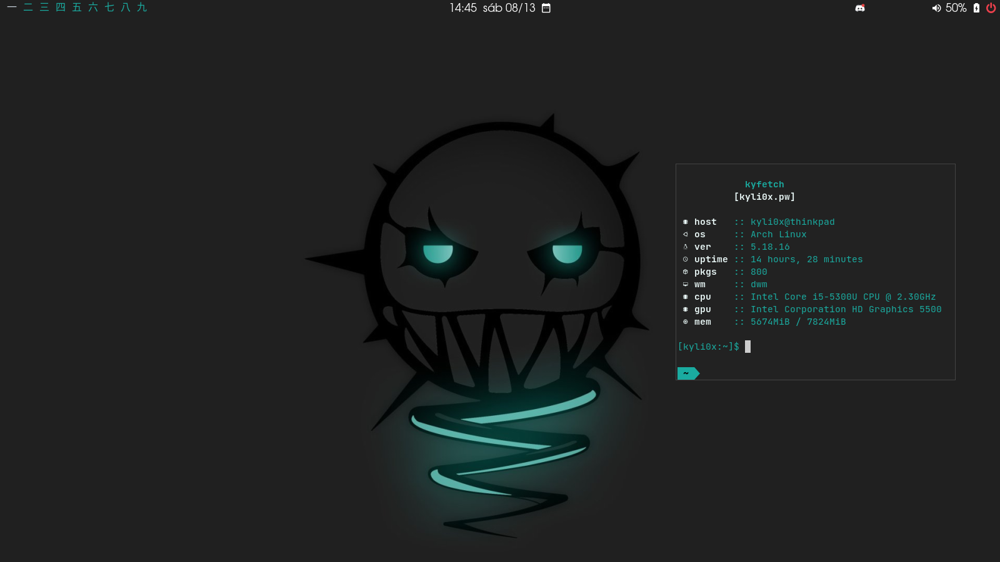
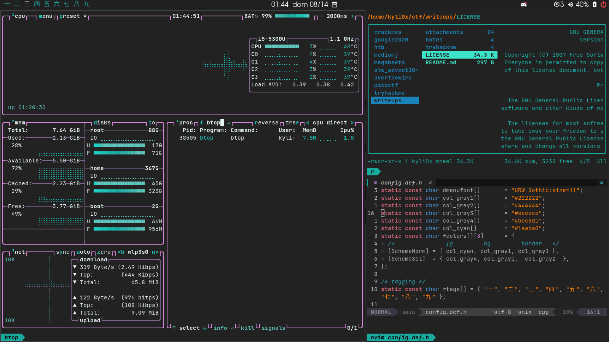
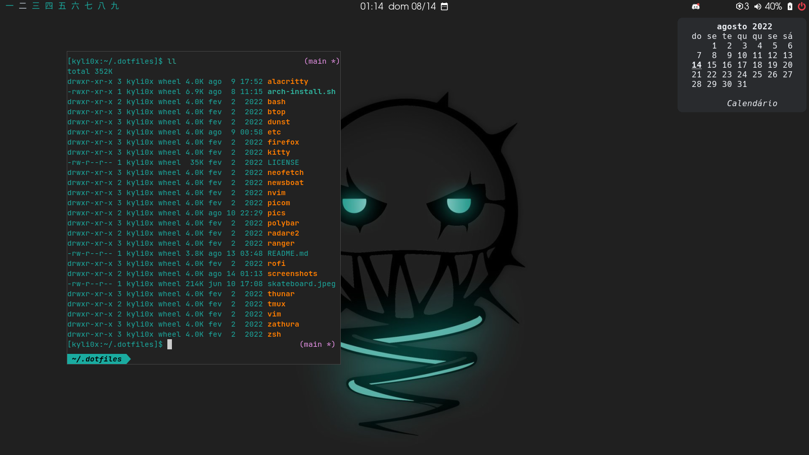
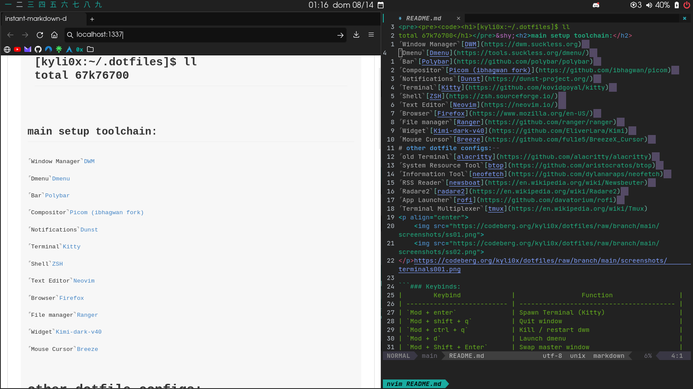
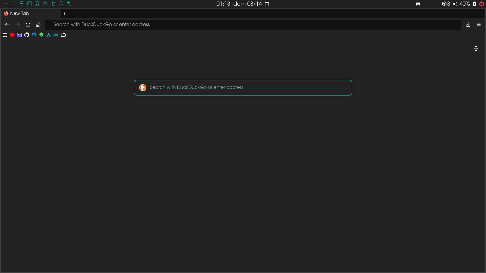

<pre><pre><code><h1>[kyli0x:~/.dotfiles]$ ll
total 67k76700</h1></pre>&shy;<details><summary> Screenshots</summary>




</details>
<h2>main setup toolchain:</h2>⌜Window Manager⌝[DWM](https://dwm.suckless.org)
⌜Dmenu⌝[Dmenu](https://tools.suckless.org/dmenu/)
⌜Bar⌝[Polybar](https://github.com/polybar/polybar)
⌜Compositor⌝[Picom (ibhagwan fork)](https://github.com/ibhagwan/picom)
⌜Notifications⌝[Dunst](https://dunst-project.org/)
⌜Terminal⌝[Kitty](https://github.com/kovidgoyal/kitty)
⌜Shell⌝[ZSH](https://zsh.sourceforge.io/)
⌜Text Editor⌝[Neovim](https://neovim.io/)
⌜Browser⌝[Firefox](https://www.mozilla.org/en-US/)
⌜File manager⌝[Ranger](https://github.com/ranger/ranger)
⌜Widget⌝[Kimi-dark-v40](https://github.com/EliverLara/Kimi)
⌜Mouse Cursor⌝[Breeze](https://github.com/ful1e5/BreezeX_Cursor)
# other dotfile configs:  
⌜old Terminal⌝[alacritty](https://github.com/alacritty/alacritty)
⌜System Resource Tool⌝[btop](https://github.com/aristocratos/btop)
⌜Information Tool⌝[neofetch](https://github.com/dylanaraps/neofetch)
⌜RSS Reader⌝[newsboat](https://en.wikipedia.org/wiki/Newsbeuter)
⌜Radare2⌝[radare2](https://en.wikipedia.org/wiki/Radare2)
⌜App Launcher⌝[rofi](https://github.com/davatorium/rofi)
⌜Terminal Multiplexer⌝[tmux](https://en.wikipedia.org/wiki/Tmux)

```### Keybinds:
|        Keybind             |                 Function                 |
| -------------------------- | ---------------------------------------- |
| `Mod + enter`              | Spawn Terminal (Kitty)                   |
| `Mod + shift + q`          | Quit window                              |
| `Mod + ctrl + q`           | Kill / restart dwm                       |
| `Mod + d`                  | Launch dmenu                             |
| `Mod + Shift + Enter`      | Swap master window                       |
| `Mod + j`                  | Focus next stacked window                |
| `Mod + k`                  | Focus previous stacked window            |
| `Mod + i`                  | Increment master window                  |
| `Mod + o`                  | Decrement master window                  |
| `Mod + h`                  | Increase master horizontal size          |
| `Mod + l`                  | Decrease master horizontal size          |
| `Mod + tab`                | Toggle between tags                      |
| `Mod + tag number`         | Change current tag                       |
| `Mod + Shift + tag number` | Move focused window to another tag       |
| `Mod + 0`                  | View all active tags                     |
| `Mod + t`                  | Tiled layout                             |
| `Mod + f`                  | Floating layout                          |
| `Mod + m`                  | Monocle layout                           |
| `Mod + -`                  | Decrease gaps                            |
| `Mod + =`                  | Incease gaps                             |
| `Mod + Shift + =`          | Remove gaps                              |
| `Mod + w`                  | Spawn broswer (brave)                    |
| `Mod + Shift + d`          | Spawn discord-canary                     |
| `Mod + Shift + m`          | Spawn Matrix (element)                   |

Hint: `Mod` key is set to the `Win` / `Super` key.

### Some Vim keybinds:
|        Keybind             |                 Function                 |
| -------------------------- | ---------------------------------------- |
| `Ctrl + n`                 | Launch file tree (nvim-tree)             |
